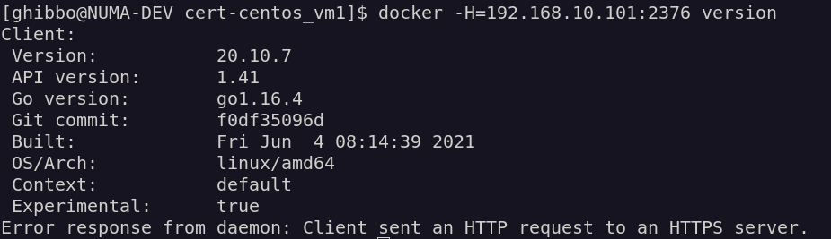
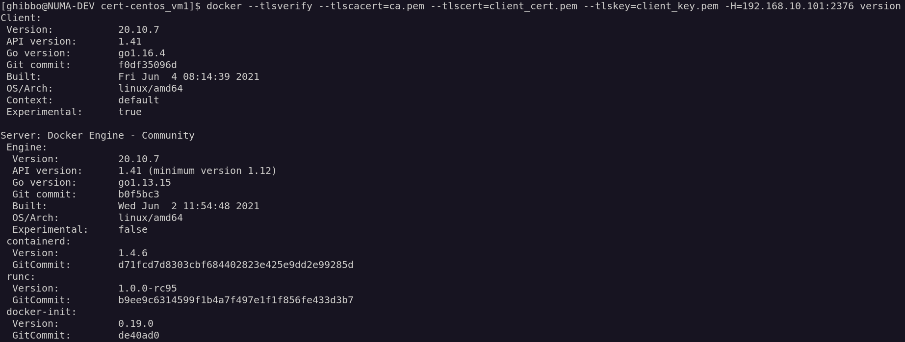
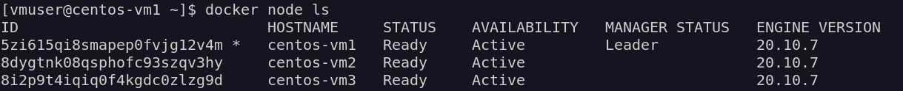
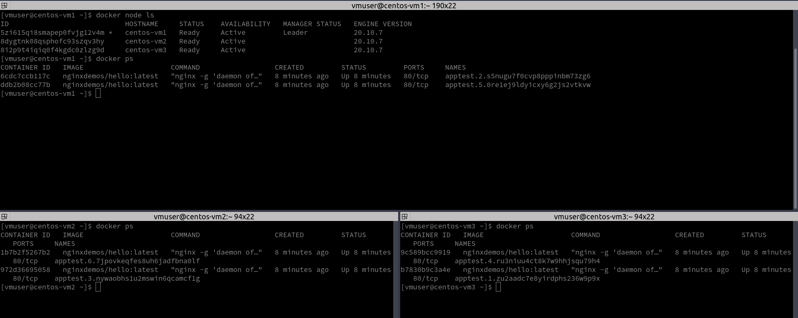
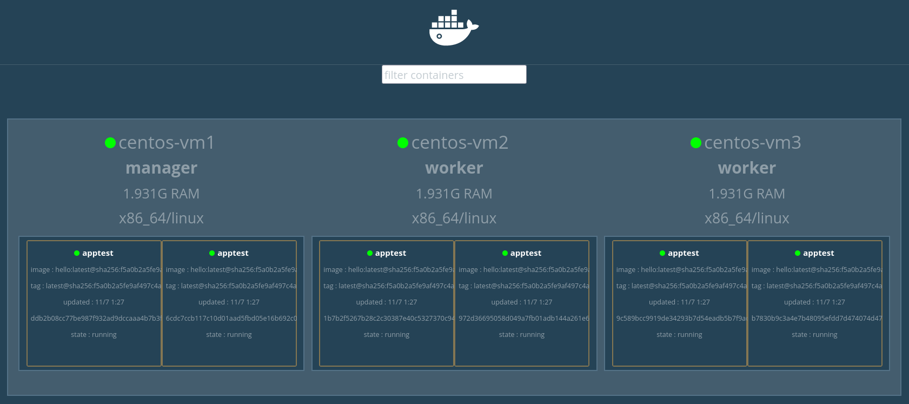

# Challenge

[](https://app.travis-ci.com/ghibbo/Challenge)

Realizzare un playbook Ansible che permetta di svolgere le seguenti attività:

1. Provisioning di VMs CentOS. Le VM possono essere locali o su un Cloud provider a scelta.
2. Configurare le VM:
	* Assicurarsi che la partizione utilizzata da Docker abbia almeno 40GB di spazio disponibile
3. Setup di Docker sulle VM
4. Configurare Docker:
	* Esporre le API REST del Docker Daemon in modo sicuro
	* Assicurarsi che il Docker Daemon sia configurato come un servizio che parta automaticamente all'avvio del sistema
5. Configurare un Docker Swarm sulle VM, che sia accessibile in modo sicuro.
	* Assicurarsi di riuscire ad interagire e deployare servizi sullo Swarm dalla macchina locale.
6. Opzionalmente:
	* Testare un task a scelta dei precedenti utilizzando Molecule

Rappresentare ogni attività con opportuni ruoli Ansible e relativi task. 

Versioning del Codice:

1. Versionare il codice su un repository pubblico su Github.com

Continuous Integration:
1. Configurare una pipeline di Continuous Integration su un tool a scelta (Travis)
2. La pipeline deve:
  * Eseguire il linting del codice e fallire in caso di errori, che vanno opportunamente corretti


## Descrizione

Questo playbook fornisce ***n*** VM Centos, le VM sono locali.
Le VM sono partizionate per garantire che Docker disponga di almeno 40 GB di spazio disponibile.
Docker espone in modo sicuro le API REST di Docker Daemon.
Docker Daemon è configurato come un servizio che si avvia automaticamente all'avvio del sistema.
Inizializza e configura Docker Swarm sul nodo manager e aggiunge i nodi worker allo Swarm.
Testa I' interazione e distribuzione di servizi sui nodi del cluster Swarm dalla macchina locale. 


## Pre-Requisiti Lab Locale

Con l'aiuto di due piccoli strumenti, possiamo rendere il test locale degli script di provisioning più veloce e più piacevole. 

Utilizzeremo Vagrant per avviare una VM locale, fornire quella VM con Ansible.

Vagrant è uno degli strumenti preferiti dagli sviluppatori. Vagrant è uno strumento progettato per consentire agli utenti di creare e configurare ambienti di sviluppo leggeri, riproducibili e portatili con gli ambienti di virtualizzazione. 

E' possibile utilizzare Ansible con Vagrant per automatizzare il provisioning della macchine secondo requisiti e settaggi voluti. 

> vm.provision "ansible", playbook: "centos.yml"

Per verificare che l'ambiente di sviluppo sia correttamente configurato dobbiamo utilizzare una macchina Linux o MacOs.

Pacchetti necessari:

* Vagrant
* Ansible
* Ambiente di virtualizzazione (**VirtualBox**, KVM, VMware etc..)

Nella cartella 'startup_test' sono presenti 2 file:

* Vagrantfile
* cestos.yml

Il file **Vagrantfile** crea 2 macchine CentOS 8 con indirizzi di rete privati. 

Il file **centos.yml** contiene una configurazione minimale di una macchina virtuale.

Verifica iniziale dell'ambiente di Test:

```v
vagrant up
```


## Provisioning
Vagrantfile del progetto:

```v
ENV["VAGRANT_EXPERIMENTAL"] = "disks"

Vagrant.configure("2") do |config|
  
  config.disksize.size = '50GB'

  number_of_machines = 3
  
  box_name = "centos/8"

  base_ip = 100
  base_ip_addresses = "192.168.10"

  ip_addresses = (1..number_of_machines).map{ |i| "#{base_ip_addresses}.#{base_ip + i}" }

  config.vm.provider "virtualbox" do |v|
    v.memory = 2048

  end

  (1..number_of_machines).each do |i|
    config.vm.define "centos_vm#{i}" do |box|
      box.vm.box = box_name      
      box.vm.disk :disk, size: "40GB", name: "extra_storage"
      box.vm.network "private_network", ip: "#{ip_addresses[i-1]}"
      box.vm.hostname = "centos-vm#{i}"
      box.vm.provision "ansible", playbook: "main.yml"
    end
  end

end
```


Inventory File
------------

Il file inventario Ansible descrive i dettagli degli host nel cluster, nonché la configurazione. Una volta che l'inventario è stato definito, utilizziamo il modello per selezionare gli host o i gruppi per la configurazione di docker e swarm.

>  Esempio:

centos-vm1 ansible_ssh_host=192.168.10.101

centos-vm2 ansible_ssh_host=192.168.10.102

centos-vm3 ansible_ssh_host=192.168.10.103


[docker-nodes]

centos-vm1

centos-vm2

centos-vm3


[swarm-managers]

centos-vm1


[swarm-workers]

centos-vm2

centos-vm3


[docker:vars]

ansible_python_interpreter=/usr/bin/python3Role Variables


## Ruoli

Un ruolo contiene le attività del playbook Ansible, oltre a tutti i file, le variabili, i modelli e i gestori di supporto necessari per eseguire le attività. Un ruolo è un'unità completa di automazione che può essere riutilizzata e condivisa. 

Utilizzando lo strumento da riga di comando ansible-galaxy, si puoi creare un ruolo con il comando init. 

```Ansible
ansible-galaxy init role
```

I ruoli principali sono:

1. Inizializzazione
2. Docker 
3. Swarm


## Configurazione Iniziale

Questo ruolo si occupa di creare i settaggi e le configurazioni base di ogni singola VM.

Settaggi e Configurazioni:

- Aggiunta dei Repo EPEL (Extra Packages for Enterprise Linux)

* Installa pacchetti base:
  * bash-completion
  * vim
  * nano
  * tmux
  * python3-cryptography (Utility per crittografare e decrittografare i dati.)
  * python3-pyOpenSSL (Wrapper per libreria OpenSSL)
* Crea utente e password:
  * user: vmuser
  * password: Password1
* Aggiunge utente nel gruppo sudoers
* Accesso SSH

 

## Docker

Questo ruolo si occupa di installare, configurare, securizzare e testare docker su ogni VM.

Struttura:

- Creazione di una partizione di 40 GB
  - Ext4 file system
  - Mount device in /docker_data

* Check vecchie versioni non installate
* Creazione di un docker repository
* Installazione:
  * Docker
  * Pip
  * Docker SDK
* Generazione delle chiavi e certificati per Autenticazione applicazioni client/server
  * Creazione della directory Certificates
  * Creazione di una CA (Certification Authority) locale *self-signed*
  * Creazione di un certificato Server
  * Creazione di un certificato Client
* Avvio del servizio al boot
* Aggiunta dell'utente 'vmuser' al gruppo docker
* Update del servizio docker
  * Docker Engine API
* Securizzazione del servizio
  * Consente solo connessioni da client autenticati da un certificato firmato da quella CA.
* Test 

Docker fornisce un'API per l'interazione con il demone Docker (chiamato API Docker Engine), nonché SDK per Go e Python. Gli SDK consentono di creare e ridimensionare app e soluzioni Docker in modo rapido e semplice. Nel progetto si utilizza direttamente l'API di Docker Engine. 

Per utilizzare l'API Docker Engine, è necessario abilitare un socket TCP all'avvio del daemon. Per impostazione predefinita, un socket di unix viene creato in /var/run/docker.sock. Tuttavia, possiamo configurare il demone utilizzando l'opzione -H (Systemd socket).

Con l'opzione -H tcp://0.0.0.0:7777, il demone aprirà un socket TCP in ascolto sulla porta TCP 7777 per tutte le interfacce di sistema. 

> ​	Example:
>
> Possiamo recuperare l'elenco dei contenitori utilizzando qualsiasi client http: 
>
> ```
> curl -X GET http://192.168.10.101:7777/containers/json?all=1
> ```

L'API è pubblica e disponibile per chiunque. Questa non è una buona idea, soprattutto se vogliamo esporre questa API su Internet. Fortunatamente, possiamo configurare una connessione TLS protetta utilizzando certificati autofirmati.

> ​	generate-ssl-certs.sh
>
> ```bash
> mkdir cert
> cd cert
> openssl genrsa -aes256 -out ca-key.pem 4096
> openssl req -new -x509 -days 365 -key ca-key.pem -sha256 -out ca.pem
> openssl genrsa -out server-key.pem 4096
> openssl req -subj "/CN=$HOST" -sha256 -new -key server-key.pem -out server.csr
> echo subjectAltName = DNS:$HOST,IP:192.168.10.101,IP:127.0.0.1 >> extfile.cnf
> echo extendedKeyUsage = serverAuth >> extfile.cnf
> openssl x509 -req -days 365 -sha256 -in server.csr -CA ca.pem -CAkey ca-key.pem -CAcreateserial -out server-cert.pem -extfile extfile.cnf
> 
> openssl genrsa -out key.pem 4096
> openssl req -subj '/CN=client' -new -key key.pem -out client.csr
> echo extendedKeyUsage = clientAuth > extfile-client.cnf
> openssl x509 -req -days 365 -sha256 -in client.csr -CA ca.pem -CAkey ca-key.pem -CAcreateserial -out cert.pem -extfile extfile-client.cnf
> rm -v client.csr server.csr extfile.cnf extfile-client.cnf
> chmod -v 0400 ca-key.pem key.pem server-key.pem
> chmod -v 0444 ca.pem server-cert.pem cert.pem
> ```
>
> 

A questo punto dobbiamo abilitare il daemon ad utilizzare questi certificati TLS.

> dockerd --tlsverify --tlscacert=CA.pem --tlscert=server_cert.pem --tlskey=server_key.pem -H=0.0.0.0:2376

Lato Client:

> docker --tlsverify --tlscacert=ca.pem --tlscert=cert.pem --tlskey=key.pem -H=192.168.10.101:2376 version


### Test

Richiesta al server senza autenticazione:



Richiesta al server con autenticazione tramite TLS:

 


## Swarm

La funzionalità di gestione e orchestrazione del cluster incorporata nel Docker Engine è denominata *Docker Swarm.*

Un cluster Swarm di host o nodi Docker è un cluster di server a disponibilità elevata che viene eseguito in modalità Swarm.

Un *nodo* è un host fisico o una macchina virtuale su cloud o hypervisor locale che esegue Docker. I nodi manager assegnano le attività ai worker in base al numero di repliche del servizio.

Un *servizio* è un attività da eseguire sul nodo manager o nodo/i worker. 

Questo ruolo si occupa di Impostare e configurare un Docker Swarm:

* Determina lo stato di Swarm di ciascun nodo
* Ogni nodo manager e classificalo come funzionale o non inizializzato
* Esegue lo stesso controllo sui nodi worker e li classifica come collegati o scollegati al nodo manager 
* Il cluster Docker Swarm è configurato per utilizzare IP privati. 
* Inizializza il nodo manager:   docker swarm init
* Recupera i token manager e worker di unione dal nodo manager attivo
* Unisce i nodi worker al cluster tramite token


### Test

Una volta creato il nostro cluster, possiamo listare i nodi docker usando il comando:

```docker
docker service node ls
```



Per distribuire un'applicazione altamente disponibile e scalabile, utilizzeremo un servizio la cui immagine è pubblicata su Docker Hub.

```docker
docker service create --name apptest --replicas=6 --publish published=8080,target=8080 nginxdemos/hello
```



Per avere una visualizzazione grafica dei nostri nodi nel cluster Swarm, possiamo utilizzare Docker Swarm Visualizer.

```
docker run -it -d -p 5000:8080 -v /var/run/docker.sock:/var/run/docker.sock dockersamples/visualizer
```




## Code linting

Il linting è *“uno strumento che analizza il codice sorgente per contrassegnare  errori di programmazione, bug, errori stilistici e costrutti sospetti”*. 

*ansible-lint* consente di effettuare questo tipo di verifica sul nostro playbook e ruolo. 

Per installarlo:

```
pip install ansible-lint
```

Per verificare il codice ci spostiamo nella directory root del progetto ed eseguiamo:

```
ansible-lint main.yml
```

*ansible-lint* verificherà il contenuto del playbook e dei ruoli utilizzati secondo delle regole ben definite, riportandoci eventuali errori e violazioni delle best practices:

```
risky-file-permissions: File permissions unset or incorrect
roles/initialize/tasks/sudoers.yml:1 Task/Handler: Add sudo rights for vmuser
```

E’ possibile ignorare alcune regole specificandone i codici identificativi sulla command line.

```
ansible-lint main.yml -x 206 -x 503 -v

WARNING  Listing 1 violation(s) that are fatal
risky-file-permissions: File permissions unset or incorrect
roles/initialize/tasks/sudoers.yml:1 Task/Handler: Add sudo rights for vmuser

You can skip specific rules or tags by adding them to your configuration file:
# .ansible-lint
warn_list:  # or 'skip_list' to silence them completely
  - experimental  # all rules tagged as experimental

Finished with 0 failure(s), 1 warning(s) on 28 files.

```

Ad ogni modifica dei nostri ruoli potremo utilizzare *ansible-lint* per verificare la conformità e il rispetto delle opportune best practices. 


## Molecule

[Molecule](https://molecule.readthedocs.io/en/latest/) è uno strumento pensato per testare i propri ruoli Ansible, in diversi  scenari e con diversi sistemi operativi, appoggiandosi a diversi  provider di virtualizzazione e Cloud. 

Installazione:

```
pip install molecule
```

TODO: .......


